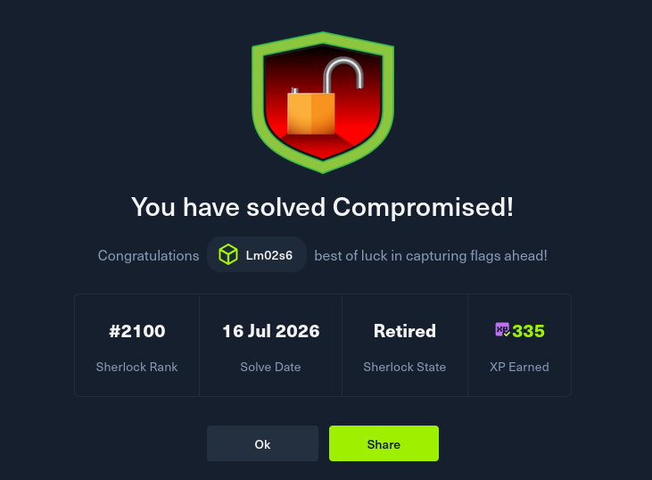

# 🔍 Compromised — Sherlock Investigation

**Platform:** Hack The Box (Sherlock - Easy SOC Category)  
**Status:** ✅ Completed  

---

## 📌 Challenge Overview

> Our SOC team detected suspicious activity in network traffic. The machine has been compromised and company information that should not have been there has now been stolen – it is up to you to figure out what has happened and what data has been taken.

This investigation involved analyzing a malicious packet capture (`capture.pcap`) to identify the attack vector, malware family, C2 infrastructure, and data exfiltration methods used by the attacker.

---

## 🧠 Investigation Summary

| Phase | Action | Finding |
| :--- | :--- | :--- |
| **1. Triage** | Sorted IPv4 conversations to find suspicious external IPs communicating with the victim (`172.16.1.191`). | Identified `162.252.172.54` downloading a file disguised as a GIF. |
| **2. Payload Extraction** | Extracted the file from the pcap and submitted to VirusTotal. | Flagged as malicious — SHA256: `9b8ffdc8ba2b...` |
| **3. Malware Identification** | Analyzed VirusTotal results. | Identified as **Pikabot** malware family. |
| **4. C2 Traffic Analysis** | Used `tshark` to extract TLS Certificate messages and inspect self-signed certificates. | Malicious traffic on ports `2078`, `2222`, and `32999`. |
| **5. Certificate Forensics** | Inspected X.509 certificate fields on suspicious ports. | `id-at-localityName`: `Pyopneumopericardium`   `notBefore`: `2023-05-14 08:36:52 UTC` |
| **6. Exfiltration Analysis** | Analyzed DNS traffic (76.1% of capture) using `tshark`. | DNS tunneling via `steasteel.net`. |

---

## 📊 Key Indicators of Compromise (IoCs)

| Indicator Type | Value |
| :--- | :--- |
| **Attacker IP** | `162.252.172.54` |
| **Victim IP** | `172.16.1.191` |
| **Internal DNS** | `172.16.1.16` |
| **SHA256 Hash** | `9b8ffdc8ba2b2caa485cca56a82b2dcbd251f65fb30bc88f0ac3da6704e4d3c6` |
| **Malware Family** | `pikabot` |
| **C2 Ports** | `2078`, `2222`, `32999` |
| **Tunneling Domain** | `steasteel.net` |
| **Tunnel Endpoint** | `dns.steasteel.net` |
| **Cert Locality** | `Pyopneumopericardium` |

---

## 📁 Detailed Report

All findings, commands, screenshots, and forensic methodology are documented in:

📄 **[Compromised_Writeup.pdf](./Compromised_Writeup.pdf)**

---

## 🔗 Challenge Link

[Hack The Box — Compromised Sherlock](https://www.hackthebox.com/)

---

## ✅ Completion Proof

---

## 👤 Author

**DFIR Analyst**  
*SOC — Network Forensics & Malware Analysis*
