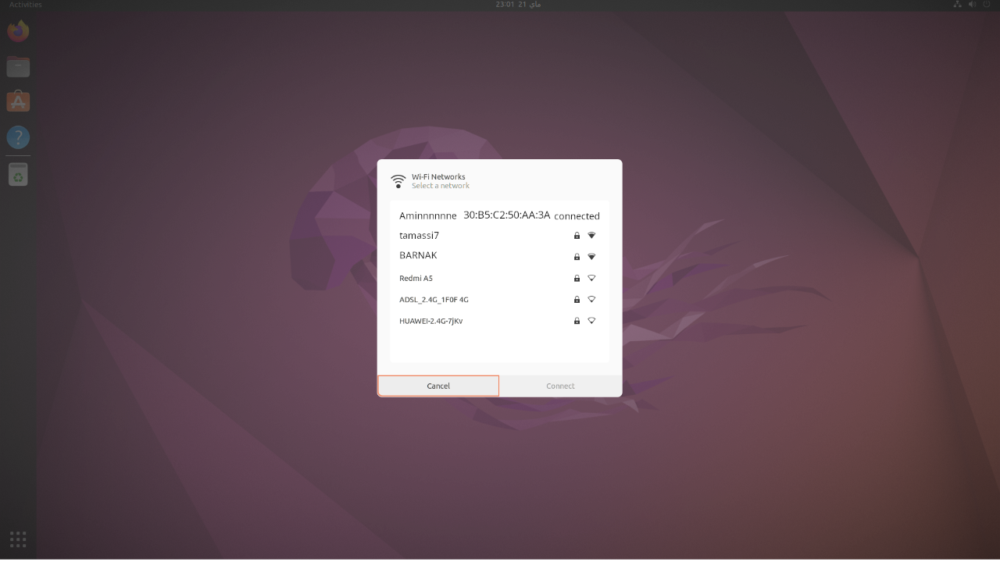

# Hackers get Hacked DFIR chalenge Writeup

### Description

This challenge provided an attacker-side AD1 image. The objective was to reconstruct the full incident: malware delivery, payload execution, persistence, pentester activity, attacker infrastructure, and leftover forensic artifacts.

At first, I made the mistake of trying to guess answers from random strings. I later switched to a structured workflow: mount the image, identify important artifacts, inspect browser history, review PowerShell history, parse scan results, and then answer each question based on evidence.

I also had some tooling issues. Since the evidence was in FTK AD1 format, the most convenient tool would have been `FTK Imager`. It can open AD1 files directly and export artifacts easily, and other players found it much simpler. I had problems installing FTK Imager during the CTF, so I continued with Linux tools, mainly `AD1-tools`.

This worked, but `ad1mount` was unstable at times. The FUSE mount disconnected several times, especially when reading large files like the WSL `ext4.vhdx`. Because of this, some steps required extra troubleshooting and alternative approaches such as Edge history, cache files, Recent shortcuts, and raw strings.

If you repeat this challenge, I recommend FTK Imager first. If you use Linux, expect to troubleshoot AD1 mounting issues.

### Initial Triage

Before focusing on individual questions, I identified the main forensic areas that could contain evidence:

- Browser history and downloads
- PowerShell history
- Prefetch execution artifacts
- User documents and scans
- Edge cache data
- Downloaded binaries
- Extracted images and metadata

This helped structure the investigation instead of searching randomly.

### Mounting the Image

I first mounted the image and created some short variables to make the commands easier to read.

```bash
mkdir -p mnt_ad1
ad1mount -i hgh.ad1 -m mnt_ad1
ROOT="$(find mnt_ad1 -type d -name '[root]' | head -n 1)"
EDGE="$ROOT/Users/amine/AppData/Local/Microsoft/Edge/User Data/Default"
PWSH="$ROOT/Users/amine/AppData/Roaming/Microsoft/Windows/PowerShell/PSReadLine/ConsoleHost_history.txt"
DOCS="$ROOT/Users/amine/Documents"
DL="$ROOT/Users/amine/Downloads"
PREFETCH="$ROOT/Windows/Prefetch"
```

## Solved Questions

### Q1. What IP address did the pentester identify as the attacker infrastructure?

At the start, I began with the browser history and simply looked at the latest visited URLs.

```bash
sqlite3 -header -csv "$EDGE/History" \
"select datetime((visits.visit_time/1000000)-11644473600,'unixepoch') as ts, urls.url
 from visits
 join urls on visits.url=urls.id
 order by visits.visit_time desc
 limit 50;"
```

I found several interesting URLs:

```text
"2026-05-22 09:00:18",https://198.51.100.1:3923/pic2.png
"2026-05-22 09:00:09",http://198.51.100.80:8989/
"2026-05-22 08:38:18",http://git.nox.local/
"2026-05-22 07:46:13",https://www.exploit-db.com/exploits/51141
"2026-05-22 04:18:26",https://nvd.nist.gov/vuln/detail/CVE-2020-36911
```

This showed me that `198.51.100.80` and `198.51.100.1` were both important, but I still needed stronger proof for the real attacker infrastructure. So I looked for scan files in `Documents`.

```bash
find "$DOCS" -type f
sed -n '1,120p' "$DOCS/nox_scan.xml"
```

That gave the answer clearly:
```text
... nmap ... -oX /mnt/c/Users/amine/Documents/nox_scan.xml 198.51.100.80
<address addr="198.51.100.80" addrtype="ipv4"/>
<hostname name="shadow-circuit-game.test" type="PTR"/>
```

So I concluded that the pentester identified this machine as the attacker infrastructure.

Answer:

```text
198.51.100.80
```

### Q2. What archive delivered the malware?

Next, I wanted to know how the malware arrived. The best place for that was the downloads database.

```bash
sqlite3 -header -csv "$EDGE/History" \
"select id,current_path,target_path,tab_url
 from downloads
 order by start_time;"

find "$DL" -maxdepth 2 -type f
```

I found a very suspicious download:

```text
4,"",C:\Users\amine\Downloads\ShadowCircuit_Setup.zip,http://shadow-circuit-game.test/downloads/ShadowCircuit_Setup.zip
6,C:\Users\amine\Downloads\ShadowCircuit_Setup.zip,C:\Users\amine\Downloads\ShadowCircuit_Setup.zip,http://shadow-circuit-game.test/downloads/ShadowCircuit_Setup.zip
ad1mnt/.../Users/amine/Downloads/ShadowCircuit_Setup.zip
```

This strongly indicated that the malware was delivered through that ZIP archive.

Answer:

```text
ShadowCircuit_Setup.zip
```


### Q4. Hash of the malicious payload (MD5)

Once I identified `sc_updater.exe` as the suspicious file, I hashed it directly from the mounted image.

```bash
md5sum "$DL/ShadowCircuit_Setup/ShadowCircuit/sc_updater.exe"
```

I found:

```text
\22a8a452b8e97546843614868a0d87b6  ad1mnt/C:\\:NONAME [NTFS]/[root]/Users/amine/Downloads/ShadowCircuit_Setup/ShadowCircuit/sc_updater.exe
```

Answer:

```text
22a8a452b8e97546843614868a0d87b6
```

### Q5. Which MITRE ATT&CK technique ID describes the persistence mechanism?

For persistence, I checked PowerShell history. This is usually one of the easiest places to understand what was done manually.

```bash
rg -n "New-ItemProperty|CurrentVersion|run|Run" "$PWSH"
nl -ba "$PWSH" | sed -n '23,28p'
```

I found the exact registry persistence command:

```text
26  $path = "HKLM:\SOFTWARE\Microsoft\Windows\CurrentVersion\run"
27  New-ItemProperty -Path $path -Name "update-srv" -Value "C:\Users\amine\Downloads\ShadowCircuit_Setup\ShadowCircuit" -PropertyType "String"
```

This is a Run key, which maps to the known ATT&CK persistence technique.

Answer:

```text
T1547.001
```

### Q6. What C2 framework was present on the attacker infrastructure?

At this point, I knew there was malware and operator activity, so I wanted to identify the framework. I checked PowerShell history, browser activity, and the malware strings.

```bash
rg -ni "docker|listener|profile|launcher|grunt|http" "$PWSH"

sqlite3 -header -csv "$EDGE/History" \
"select datetime((visits.visit_time/1000000)-11644473600,'unixepoch') as ts, urls.url
 from visits
 join urls on visits.url=urls.id
 order by visits.visit_time desc
 limit 80;"

strings -n 4 "$DL/ShadowCircuit_Setup/ShadowCircuit/sc_updater.exe" | rg "GruntStager|CovenantCertHash|CookieWebClient|Listener"
```

I found the most useful clues inside the updater:

```text
GruntStager
CovenantCertHash
CookieWebClient
```

I also noticed this in the downloads:

```text
3,C:\Users\amine\Downloads\GruntHTTP.exe,C:\Users\amine\Downloads\GruntHTTP.exe,https://198.51.100.1:3923/
```
Further research showed that:
`GruntHTTP` is the default template and payload format used by `Covenant` for its implant (agent) communications over the HTTP protocol. 

`GruntHTTP` and the strings inside `sc_updater.exe` pointed strongly to Covenant.

Answer:

```text
Covenant
```


### Q8. How many open TCP ports did the pentester’s scan find on the attacker machine and what are they?

I already had the Nmap scan open from Q1, so I reused it here.

```bash
rg -n 'portid=' "$DOCS/nox_scan.xml"
```

The important lines were:

```text
<port protocol="tcp" portid="22"><state state="open" ...
<port protocol="tcp" portid="80"><state state="open" ...
<port protocol="tcp" portid="7443"><state state="open" ...
```

So the scan found 3 open TCP ports.

Answer:

```text
3,22,80,7443
```

### Q9. What CVE did the pentester use against the attacker infrastructure?

I went back to browser history and looked for vulnerability research pages.

```bash
sqlite3 -header -csv "$EDGE/History" \
"select datetime((visits.visit_time/1000000)-11644473600,'unixepoch') as ts, urls.url
 from visits
 join urls on visits.url=urls.id
 where urls.url like '%nvd.nist.gov%' or urls.url like '%/vuln/detail/CVE-%'
 order by visits.visit_time desc;"
```

I found:

```text
"2026-05-22 04:18:26",https://nvd.nist.gov/vuln/detail/CVE-2020-36911
```

Answer:

```text
CVE-2020-36911
```

### Q10. What publicly available exploit did the pentester use to abuse the aforementioned CVE?

After the CVE page, I looked for public exploit references in history.

```bash
sqlite3 -header -csv "$EDGE/History" \
"select datetime((visits.visit_time/1000000)-11644473600,'unixepoch') as ts, urls.url
 from visits
 join urls on visits.url=urls.id
 where urls.url like '%exploit-db.com%'
 order by visits.visit_time desc;"
```

I found:

```text
"2026-05-22 07:46:13",https://www.exploit-db.com/exploits/51141
"2026-05-22 07:29:12",https://www.exploit-db.com/exploits/51141
"2026-05-22 04:18:40",https://www.exploit-db.com/exploits/51141
```

Answer:

```text
https://www.exploit-db.com/exploits/51141
```

### Q12. What coordinates identify the attacker’s operating location?

For this part, I followed the image trail. From downloads and PowerShell history, I found references to `pic1.png` and `pic2.png`.

```text
8,"C:\Users\amine\Downloads\pic1 (1).png","C:\Users\amine\Downloads\pic1 (1).png",http://198.51.100.80:8989/pic1.png
9,C:\Users\amine\Downloads\pic2.png,C:\Users\amine\Downloads\pic2.png,http://198.51.100.80:8989/pic2.png
98:ncat -lnvp 4444 > pic1.png
99:ncat -lnvp 4488 > pic1.png
102:ncat -lnvp 4488 > pic1.png
```

I had trouble recovering the images cleanly at first, so I used a broader approach and copied out image files by type.

```bash
find "$ROOT/Users/amine" -type f -size +1k -size -80M -print0 \
| while IFS= read -r -d '' f; do
info="$(file -b "$f" 2>/dev/null)"
if echo "$info" | grep -Eiq 'PNG image|JPEG image|Web/P image|GIF image|BMP|TIFF|AVIF|HEIF'; then
ext="bin"
echo "$info" | grep -Eiq 'PNG image' && ext="png"
echo "$info" | grep -Eiq 'JPEG image' && ext="jpg"
echo "$info" | grep -Eiq 'Web/P image' && ext="webp"
echo "$info" | grep -Eiq 'GIF image' && ext="gif"
echo "$info" | grep -Eiq 'BMP' && ext="bmp"
echo "$info" | grep -Eiq 'TIFF' && ext="tif"
h="$(sha256sum "$f" | cut -c1-12)"
base="$(basename "$f" | tr '/ :\\' '____')"
cp "$f" "$PWD/${h}_${base}.${ext}"
printf '%s\t%s\t%s\n' "$(stat -c%s "$f")" "$f" "$info"
fi
done | sort -n | tee "$all_images_by_magic.txt"
```

After reviewing the recovered images, I found one that exposed the Wi-Fi BSSID used by the attacker environment.


After correlating the BSSID with public geolocation sources, I obtained the following coordinates:

```text
BSSID: 30:B5:C2:50:AA:3A
Location: 33.544910, -7.676091
```

Answer:

```text
33.544910, -7.676091
```

### Q13. What was the attacker’s most recent code-hosting repository?

I saw `git.nox.local` in browser history, so I moved to the Edge cache to look for better evidence. Cache data often contains server responses that are more useful than page titles.

```bash
CACHE_DATA2="$(find "$EDGE/Cache/Cache_Data" -maxdepth 1 -name 'data_2' | head -n 1)"

sqlite3 -header -csv "$EDGE/History" \
"select id,url,title,visit_count,last_visit_time
 from urls
 where url like '%git%'
 order by last_visit_time;"

strings -n 5 "$CACHE_DATA2" | rg -n -C 2 "repo/search|full_name|updated"
```

I found the answer directly in the cached response:

```text
{"ok":true,"data":[{"repository":{"id":1,"owner":null,"name":"","full_name":"nox/ghost-hook"
```

Answer:

```text
nox/ghost-hook
```


## Unsolved Questions:

### Q3. Which MITRE ATT&CK technique ID describes the execution mechanism?

To understand execution, I checked what was inside the extracted download folder and then verified whether those files had actually been run.

```bash
find "$DL/ShadowCircuit_Setup" -maxdepth 3 -type f
find "$PREFETCH" -maxdepth 1 | rg 'SC_UPDATER|SHADOWCIRCUIT'
```

I found:

```text
.../ShadowCircuit/sc_updater.exe
.../ShadowCircuit/ShadowCircuit.exe
.../SC_UPDATER.EXE-99965BFA.pf
.../SHADOWCIRCUIT.EXE-E72CB065.pf
```

This told me that the user received a ZIP, extracted it, and then both the game and the updater were executed. So the behavior is clear, but the exact MITRE ATT&CK ID still needs confirmation. A previous guess was already rejected, so I kept this one unresolved.

### Q7. What is the SHA256 hash of the attacker’s Covenant listener profile?

This was one of the hard questions. I searched the user's files for names that looked related to Covenant.

I first searched the Windows side for Covenant-related artifacts:

```bash
find ad1mnt -type f | grep -aiE 'grunt-http|grunt-tcp|GRUNTHTTP|Covenant|nox'
```
This found grunt-http, grunt-tcp, GRUNTHTTP.EXE Prefetch, and two important shortcuts: nox.lnk and nox.zip.lnk. Inspecting the shortcuts showed that the real Covenant project was not in normal Windows folders:
```bash
strings -a '.../Recent/nox.lnk'
strings -a '.../Recent/nox.zip.lnk'
```

Relevant output:

```text
\\wsl.localhost\kali-linux\home\amine\test\huh\nox
C:\Users\amine\Downloads\nox.zip
```
nox.zip was no longer present in Downloads, so I checked Edge history:

```bash
sqlite3 /tmp/edge_history.db "
select current_path,target_path,received_bytes,total_bytes,state,interrupt_reason,tab_url
from downloads
where current_path like '%nox%';
"
```

This confirmed the ZIP was downloaded successfully:

```text
C:\Users\amine\Downloads\nox.zip
http://198.51.100.80:8989/
received_bytes = 230092695
total_bytes    = 230092695
state          = 1
interrupt_reason = 0
```

The next step was to recover the extracted nox project from WSL. The AD1 contained the WSL disk:

```bash
find "$ROOT/Users/amine/AppData/Local" -iname 'ext4.vhdx' -ls
```

Output showed a real 5.8GB disk:

```text
Users/amine/AppData/Local/wsl/{...}/ext4.vhdx
Size: 6161432576
```

The expected profile location was:
```text
/home/amine/test/huh/nox/tools/ops/Covenant/Covenant/Data/Profiles
```

However, I could not complete extraction of ext4.vhdx because the AD1 FUSE mount repeatedly disconnected while reading the large VHDX file (Transport endpoint is not connected). Because of that, I could identify the correct artifact location, but I could not reproduce the final SHA256 hash from my own extracted files.


### Q14. What session cookie gave access to the attacker’s code-hosting account?

For the final question, I searched the Chromium cookies database for the internal Git service.

```bash
sqlite3 -header -csv "$EDGE/Network/Cookies" \
"select host_key,name,path,expires_utc,is_httponly,is_secure,is_persistent,hex(encrypted_value)
from cookies
where host_key like '%nox%'
   or host_key like '%git%';"
```

I found a Gitea-related cookie:

```text
git.nox.local,gitea_incredible,...
```

This was a useful clue, but I could not fully confirm the final session-cookie value from the mounted artifacts alone.

Current status:

```text
Partially identified, not fully solved.
```

# Conclusion

This challenge was a great exercise in DFIR investigation and evidence correlation. By analyzing browser history, PowerShell history, downloads, Prefetch files, cache data, and recovered images, I was able to reconstruct most of the attacker and pentester activity step by step.

The investigation highlighted the importance of following artifacts methodically. It also showed how small traces such as browser cache entries, execution artifacts, and metadata can reveal valuable information about attacker infrastructure, persistence, tooling, and operational behavior.
